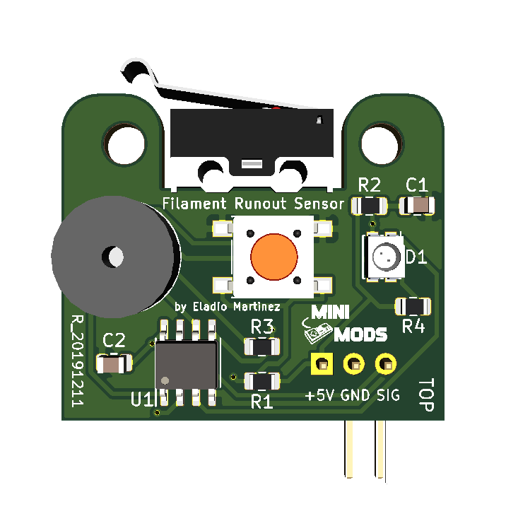
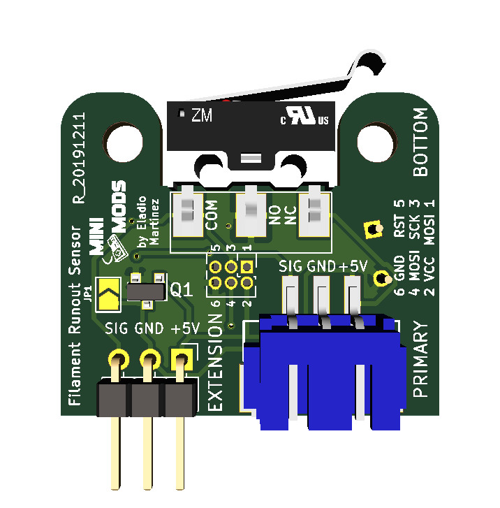

# 3D Printer Filament Runout Sensor
This is a low filament detector base on the ATtiny13 - 8-bit AVR Microcontroller for your 3d printer. When your filament runs out it will sound the alarm and flash the RGB LED giving you time to pause or reload your filament.

License
-------

 

This project is licensed under the Attribution-NonCommercial-ShareAlike CC BY-NC-SA 4.0 license. The full legal text of the license may be found in the LICENSE.md file in this repository. For more information about this license, please visit 
the Creative Commons Foundation (https://creativecommons.org/licenses/by-nc-sa/4.0/).

Features
--------
* Low filament detector for your 3d printer.

* Detect filament diameter of 1.75mm, 2.85mm and 3.00mm.

* Can interface with a variety of 3D Printer Controller Board including:
	- RAMPS 1.2 and newer
	- RAMBo 1.2 and newer
	- Printrboard Rev B,C,D,E

* Supports Marlin 1.1.X or newer, RepRap and Octoprint 1.3.8 or higher.

* Can be daisy-chain using the extension port to handle many filaments simultaneously

* Audio and visual alerts.

* One button operation mode.

* Operational Voltage: 5V

* Compact PCB design (30.62mm x 25.90mm).

* Reverse polarity protection.

* Programming pins for future firmware upgrade.

* You can buy the latest version of this board fully assembled from [http://mini-mods.com](http://mini-mods.com)

----------
* Filament Runout Sensor Top.

* Filament Runout Sensor Bottom.

----------

Prerequisites
---------------------
1. Available Z+ endstop port on your 3D printer. 

2. Access to the source code for your existing printer.

3. Arduino IDE 1.8 or newer.

Software Configuration
----------------------
### Marlin Firmware

Modify Configuration.h on Filament Runout Sensors section uncoment the following line:

		#define FILAMENT_RUNOUT_SENSOR
			
In this case I used the Z+ Port, therefore you need to set <code>FIL_RUNOUT_PIN</code> in pins_RAMPS.h to 19, add the following line to the block of code:

		#define FIL_RUNOUT_PIN  19
			
Since the sensor has its own pull-up resisters comment the following line:

		//#define FIL_RUNOUT_PULLUP 
		
Also if you need to invert the logic of the sensor set to true the followng line:

		#define FIL_RUNOUT_INVERTING false
		
Modify Configuration_adv.h in the section Advanced Pause, uncoment the following line:

		#define ADVANCED_PAUSE_FEATURE
		

More information about the Marlin configuration can be [found here.](http://marlinfw.org/docs/configuration/configuration.html#filament-runout-sensor)

Once done, flash the modified firmware to your printer.

### OctoPrint Plugin

For Raspberry Pi with OctoPrint use this Plugin: [found here.](https://plugins.octoprint.org/plugins/filament_sensor_reloaded/)

Hardware Installation
---------------------
If you are using Marlin, use the Z+ endstop port on your 3D printer to install the Filament Runout Sensor, marlin will send M600 gcode to change the filament once the sensor is triggered.

If you have a Raspberry Pi with OctoPrint setup, use the plugin above in order to use this sensor, connected to the raspberry Pi.

### Daisy-chain Configuration

The unit can handle as many filaments simultaneously, on a daisy-chain configuration using the extension port. As soon as one of the sensors run out of filament, the unit will send a message to the next one, up to - your main board.

Basic Hardware Usage
--------------------
1.- When the filament is loaded the Green led will indicate normal operation.

2.- Once the sensor detects no filament, the alarm will start, along with a flashing Blue and Red led indicators.

3.- You can mute the alarm by pressing the push button, this will set the sensor in standby mode with an intermittent Blue led.

4.- After the filament is reloaded, the led indicator will switch back to Green.

Basic Maintenance
-----------------
This sensor contains a limit switch and dust or debris can cause false or changing readings. Clean dust by blowing on the sensor or disassembly to clean the limit switch.