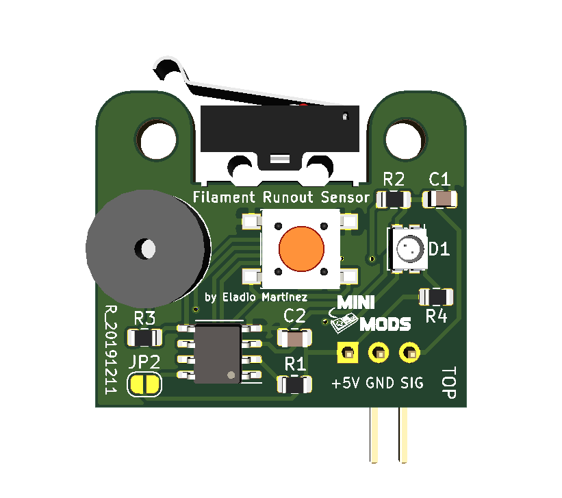
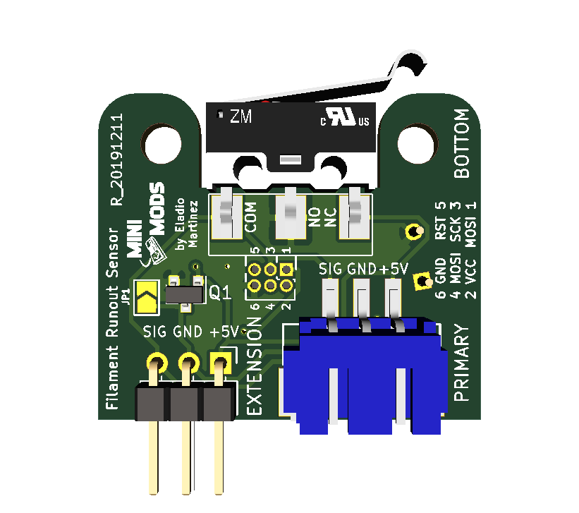
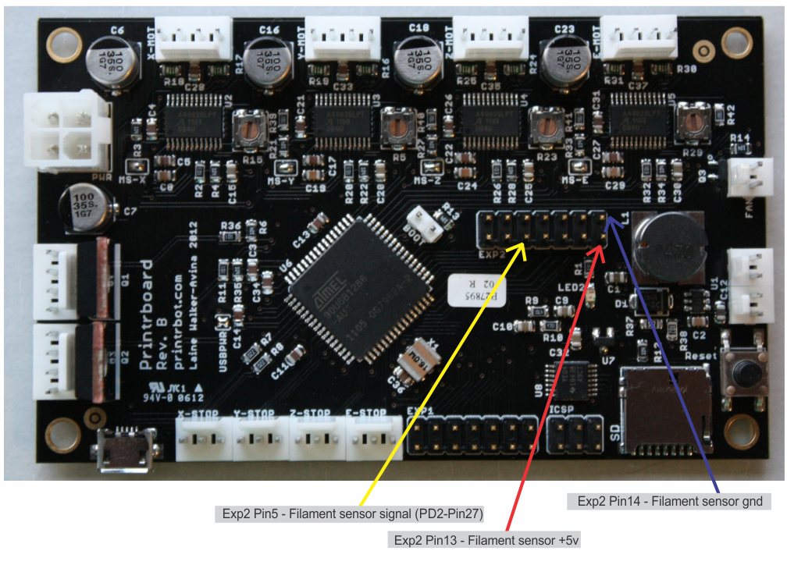

# 3D Printer Filament Runout Sensor
This is a low filament detector base on the ATtiny13 – 8-bit AVR Microcontroller compatible with all 3d printers. When the filament runs out the sensor will sound the alarm and flash the RGB LED; with the proper firmware modifications and GCode, the sensor will pause your printer giving you time to reload your filament.

License
-------

 

This project is licensed under the Attribution-NonCommercial-ShareAlike CC BY-NC-SA 4.0 license. The full legal text of the license may be found in the LICENSE.md file in this repository. For more information about this license, please visit 
the Creative Commons Foundation (https://creativecommons.org/licenses/by-nc-sa/4.0/).

Features
--------
* Detect filament diameter of 1.75mm, 2.85mm and 3.00mm.

* Can be used stand-alone without firmware modifications (Advanced features will not be available)

* Can interface with a variety of 3D Printer Controller Board to use Advanced features including:
	- RAMPS 1.2 and newer
	- RAMBo 1.2 and newer
	- Printrboard Rev B,C,D,E

* Supports Marlin 1.1.X or newer, RepRap and Octoprint 1.3.8 or higher.

* Can be daisy-chain using the extension port to simultaneously handle multi-extruder 3D printers

* Audio (44dB @ 10Ft) and visual alerts.

* One button operation mode.

* Operational Voltage: 5V

* Compact PCB design (30.62mm x 25.90mm).

* Reverse polarity protection.

* Programming pins for future firmware upgrade.

* You can buy the latest version of this board fully assembled from [http://mini-mods.com](http://mini-mods.com)

----------
* Filament Runout Sensor Top.

* Filament Runout Sensor Bottom.

----------

Prerequisites
---------------------
1. Available Z+ endstop port on your 3D printer. 

2. Access to the source code for your existing printer.

3. Arduino IDE 1.8 or newer to edit your printer’s firmware.

Software Configuration
----------------------
### Marlin Firmware

Modify Configuration.h on Filament Runout Sensors section uncomment the following line:

		#define FILAMENT_RUNOUT_SENSOR
			
In this case, I used the Z+ Port on a RAMPS Board (see other boards pinout on the Hardware Section), therefore you need to set <code>FIL_RUNOUT_PIN</code> in pins_RAMPS.h to 19, add the following line to the block of code:

		#define FIL_RUNOUT_PIN  19
			
Since the sensor has its own pull-up resisters comment the following line:

		//#define FIL_RUNOUT_PULLUP 
		
Also if you need to invert the logic of the sensor set to <code>true</code> the following line:

		#define FIL_RUNOUT_INVERTING false
		
Modify Configuration_adv.h in the section Advanced Pause, and uncomment the following line:

		#define ADVANCED_PAUSE_FEATURE
		
Once done, flash the modified firmware to your printer.

More information about the firmware configuration is available at the official Marlin Documentation [found here.](http://marlinfw.org/docs/configuration/configuration.html#filament-runout-sensor)

### OctoPrint Plugin

For Raspberry Pi with OctoPrint use this Plugin: [found here.](https://plugins.octoprint.org/plugins/filament_sensor_reloaded/)

Hardware Installation
---------------------
This sensor works with all available materials and is fully compatible with the 3D Printer boards listed below to take advantage of the advanced features of the sensor, an available Z+ endstop port is required to interface with the 3D printer, with the correct firmware modification and settings, the sensor will pause the printing until the operator reloads the filament and resume the process.

### Stand-alone Configuration

The 3D Printer Filament Runout Sensor can also be used stand-alone, without the 3D printer’s firmware modification by connecting the sensor to an available Z+ endstop port on your 3D printer, this will enable the audio and visual notifications but will not pause the printer to perform the filament reload.

### Daisy-chain Configuration

This sensor can also be daisy-chain, this feature requires modification of your 3D printer’s firmware to handle as many extruders you have on your 3D printer and manage the filament spools independently if any of your filaments run out, Marlin will get notified as the sensor gets trigger and pause your printer using only the Z+ port on your board.

Once the firmware is configured and uploaded to your printer, Marlin will send M600 gcode to change the filament spool once the sensor is triggered.

The following images display the correct pin location for the installation for the Filament Runout Sensor.

* RAMPS 1.4 Pinout.

* RAMBo 1.2 Pinout.

* Printrboard Rev B,C,D,E Pinout.

If you have a Raspberry Pi with OctoPrint setup, use the plugin above in order to use this sensor, connected to the Raspberry Pi.

Basic Hardware Usage
--------------------
1.- When the filament is loaded the Green led will indicate normal operation.

2.- Once the sensor detects no filament, the alarm will start, along with a flashing Blue and Red led indicators.

3.- You can mute the alarm by pressing the push button, this will set the sensor in standby mode with an intermittent Blue led.

4.- After the filament is reloaded, the led indicator will switch back to Green.

Basic Maintenance
-----------------
This sensor contains a limit switch and dust or debris can cause false or changing readings. Clean dust by blowing on the sensor or disassembly to clean the limit switch. Monitor wear and tear of the 3D printer sensor's enclosure as this can cause false positives triggering the sensor.